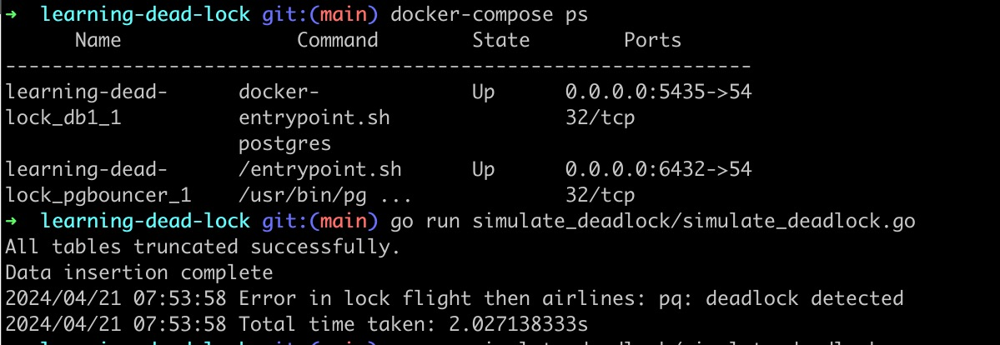

### Airline reservation system

## How to run

Give permission to postgres-init to execute script to create users

```shell
chmod +x ./postgres-init/*.sh
```

start the docker to run the 2 postgres databases

```shell
docker-compose up --build
```

## Simulate dead locks

```shell
go run simulate_deadlock/simulate_deadlock.go
```

## Why dead lock occurs here

Two transactions are started in 2 different go routines.
One transaction tries to lock the `flights` and then the `airlines`
while the other transaction tries to do just the opposite.
Now both transactions are waiting for the other to release the lock and this
results in a dead lock.

Each transaction waits for 1 second after accquiring lock and this increases the
chance of deadlock. When I removed the time.sleep then I could not simulate the
dead lock because both transactions completed within fraction of a second


